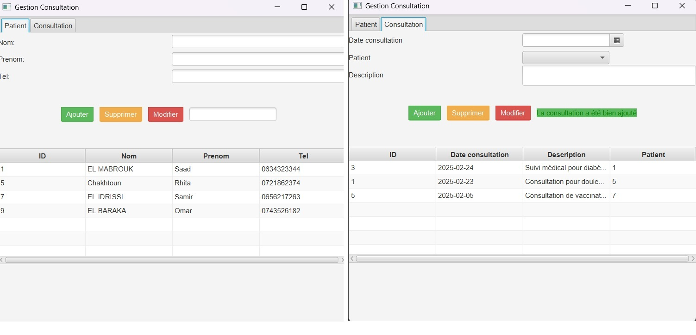
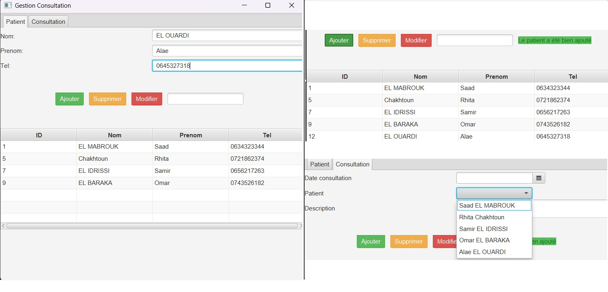
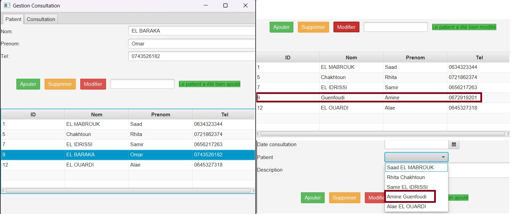
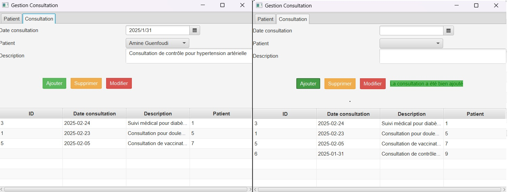
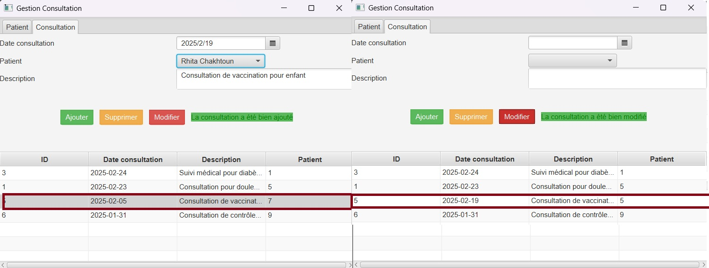
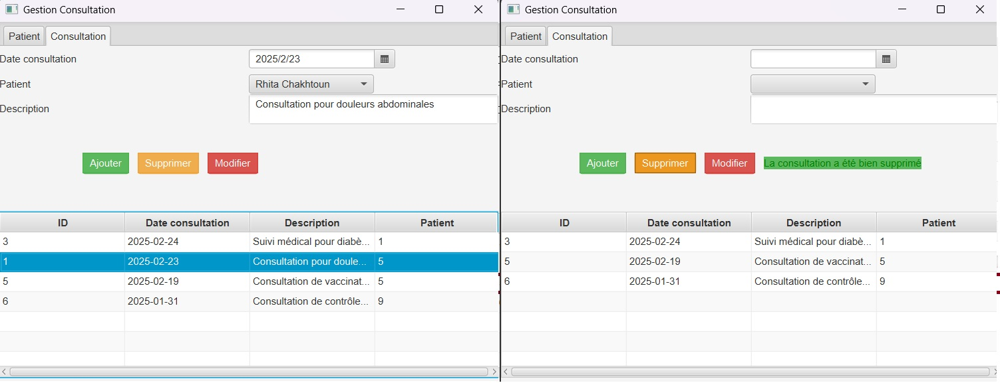

<h1>Gestion Cabinet Médical - Patients et Rendez-vous:</h1>

<h2>Écran principal de l'application</h2>

<h2>Gestion des Patients</h2>

L'ajout d'un patient met à jour automatiquement la liste des patients 
et rafraîchit la sélection des consultations en utilisant 
cabinetService.

La modification d'un patient synchronise instantanément le tableau principal et la liste des consultations via les services backend cabinetService.

Retirer un patient du système actualise en temps réel l'affichage du tableau et met à jour les options de consultation grâce à cabinetService.

<h2>Gestion des Consultations</h2>

Ajouter une consultation.

Modifier une consultation

Supprimer Une consultation

